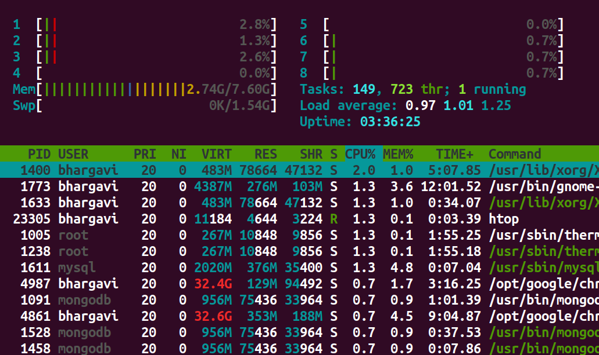

# Introduction

Recall that modern operating systems use virtualization of resources in order to make the management of processes flexible and efficient.

This experiment introduces the fundamental trick used to virtualize a process&rsquo;s access to the CPU&#x2014;namely, Context Switching. This technique allows the OS to handle arbitrary transfers of control during execution of user programs while still maintaining the overall control of the machine.


# Processes: A closer look

In the last experiment, we considered the 4 state model of a process, which provided us with a general overview of the process states and control transfer. Here, we will focus on the minute details of a process, its execution mechanism, and the transfers of control that take place during its execution&#x2014;both between user process and the kernel, and the other processes.

In this experiment, we will look more closely into the transfer of control between the processes and also the process modes. This is also where the crucial term - 'Context Switching' comes into play.

## What is Context Switching?

**Definition:** Context switching is the process that occurs when a multitasking operating system switches the execution context from one process or thread to another. 
It involves saving the current state (context) of a running process or thread so that it can be later restored and then loading the saved state of another process or thread to continue its execution. 
Context switching is a fundamental operation in modern operating systems and is necessary for efficient multitasking, allowing multiple processes or threads to share a single CPU.

-------------------------
In the above definition, we have encountered few terms like context and about loading, storing and restoring the context. Let us look more into what these terms and statements mean.

### Process Context
A process context refers to the current execution state and information associated with a running process in an operating system. It represents a snapshot of the process's execution at a particular point in time.

Process context can change dynamically while the process is executing on the CPU.

During a context switch, the current context of the process is stored in a data structure called 'Process Control block' which is later used to retreive the information of the process and resume it's excution from where it was interrupted.

### Process Control Block

In order to virtualize the execution of a process, the OS needs to have an internal account of the state of a process. This representation of the state of a process is stored in memory as a *Process Control Block(PCB)*.

The PCB is used primarily during context switches, but it doesn't actively reflect the process's changing context while it's running. Instead, the changing process context is stored in various CPU registers and memory locations, not within the PCB.

A process control block stores 3 kinds of information about a process&#x2014;namely, identification information (Pid), execution state, and control metadata used for 'scheduling' and 'Inter process communication(IPC)'.

<table border="2" cellspacing="0" cellpadding="6" rules="groups" frame="hsides">


<colgroup>
<col  class="org-left" />

<col  class="org-left" />
</colgroup>
<thead>
<tr>
<th scope="col" class="org-left">Type</th>
<th scope="col" class="org-left">Fields</th>
</tr>
</thead>

<tbody>
<tr>
<td class="org-left">Identification Information</td>
<td class="org-left">Pid</td>
</tr>


<tr>
<td class="org-left">Execution State Information</td>
<td class="org-left">PC, Mode, Registers, Flags, stacks etc.</td>
</tr>


<tr>
<td class="org-left">Scheduling &amp; IPC Information</td>
<td class="org-left">Priority, pointer to the next PCB, IPC messages etc.</td>
</tr>
</tbody>
</table>

In the above table, the execution state information holds data about the mode or level in which the process is executing in, along with the execution stack informations.

Let us take a closer look at these both terms and see how they play a important role in context switching.

### Modes of Execution

In the context of the Linux operating system architecture, there are primarily two main modes of execution:

1. **User Mode**:
   - **Privileges**: Limited privileges.
   - **Use Case**: User applications run in user mode. In this mode, processes have restricted access to system resources and cannot directly perform privileged operations. User-level code executes with a reduced set of permissions, and it cannot directly access or modify hardware resources or perform critical system tasks.

2. **Kernel Mode (Supervisor Mode or Privileged Mode)**:
   - **Privileges**: Full control over hardware and system resources.
   - **Use Case**: The Linux kernel operates in kernel mode. It has unrestricted access to the CPU, memory, hardware devices, and system services. Kernel mode is where the core operating system functions, such as device management, memory management, and system call handling, take place. Only code running in kernel mode can execute privileged operations and directly control hardware resources.

The transition between these two modes of execution is managed by the hardware. 

User-level processes running in user mode can request privileged operations (e.g., reading or writing to hardware devices or accessing protected memory) by making system calls. When a system call is made, control is transferred from user mode to kernel mode. The kernel performs the requested operation on behalf of the user-level process and then returns control to user mode.

This mode-switching mechanism is essential for maintaining system security and stability, as it prevents user-level processes from interfering with each other or with critical system resources. The Linux kernel enforces access controls and system policies to ensure that only authorized operations are allowed in kernel mode.

---------

**Refernces:**

[What are the differences between user mode and kernel mode? - Baeldung](https://www.baeldung.com/cs/user-kernel-modes)

[User-Kernel mode, syscalls, I/O, exceptions - The Unix Heritage Society](https://minnie.tuhs.org/CompArch/Lectures/week05.html)

[Kernel Mode - Science Direct](https://www.sciencedirect.com/topics/engineering/kernel-mode)

----------


### User stack and Kernel stack

In the Linux operating system (and many other operating systems), processes often maintain separate user-level and kernel-level stacks. These stacks serve different purposes and are used for distinct types of function calls and data storage. Here's an explanation of each:

1. **User Stack**:
   - **Purpose**: The user stack is used by a process to manage function calls and local variables within user-level code.
   - **Location**: The user stack is part of the process's memory space, typically allocated in the user portion of memory.
   - **Usage**: When a user-level function is called, the CPU uses the user stack to store information such as function parameters, local variables, and the return address (the address to which control should return after the function call). This stack is used for regular function calls and context within user-level code.
   - **Access**: User-level code has direct access to its user stack.

2. **Kernel Stack**:
   - **Purpose**: The kernel stack is used exclusively by the kernel when processing system calls, interrupts, and exceptions.
   - **Location**: Each process has its own kernel stack, typically located in kernel memory. The kernel stack for a process is separate from its user stack.
   - **Usage**: When a process makes a system call or encounters an exception, control switches from user mode to kernel mode. The kernel uses the process's kernel stack to store kernel-specific information and context, such as the state of CPU registers, kernel function call information, and other data needed to handle the system call or exception. It ensures that the kernel's activities do not interfere with the user-level stack.
   - **Access**: User-level code cannot directly access the kernel stack of a process. It's a part of the kernel's internal data structures.

The separation of user and kernel stacks is crucial for security and isolation. It ensures that user-level code cannot corrupt the kernel's data or execution state and vice versa. When a context switch occurs, the kernel saves the user-mode stack pointer and restores the kernel-mode stack pointer (or vice versa) to facilitate a seamless transition between user mode and kernel mode.

Additionally, for system calls, the user-level code typically provides arguments and triggers a context switch to kernel mode, where the kernel can access the user's arguments and perform the requested operation. After the kernel's work is done, it returns to user mode using the user stack, ensuring a clean separation between user and kernel code.

Now that all the important terms have been discussed, let us understand the mechanism of context switching. 

------------

**References**

[Kernel Stack and User stack - Baeldung](https://www.baeldung.com/linux/kernel-stack-and-user-space-stack#:~:text=User%20and%20Kernel%20Stacks&text=The%20user%20stack%20is%20only,mode%20switches%20to%20kernel%20mode.)

[Why is there a kernel stack for each process? - StackExchange](https://unix.stackexchange.com/questions/603348/why-is-there-kernel-stack-for-each-process-in-linux)

[Kernel stack management during syscall, interrupts and kernel modules](https://exposnitc.github.io/os_design-files/stack_description.html)

----------------

## Mechanism of context switching

In this experiment, we view the whole mechanism going through three different levels (User, Hardware and Kernel). We have already discussed the role of User mode and Kernel mode in the previous section. So let us understand the role of hardware in this mechanism.

Hardware provides instructions and mechanisms for transitioning between these privilege levels. During a context switch, the CPU switches from user mode to kernel mode to perform privileged operations, such as modifying page tables or accessing hardware devices.

Hardware also provides the fundamental mechanisms and support for transferring control to trap handlers when exceptions or traps occur. It ensures that the CPU executes the appropriate handler code with the necessary context and privilege level to handle the exceptional condition safely and effectively.

To understand the mechanism, let us consider two simple programs A and B.

Program A : Simple addtion program

```
#include <stdio.h>
int main()
{
   int a, b, c;    // Declaring variables a, b, and c
   a = 5;          // Initializing the value of variable a to 5
   b = 10;         // Initializing the value of b to 10
   c = a + b;      // Initializing the value of c to the sum of a and b
   return c;       // Return c as the output of the program
}
```

Program B : Read and add program

```
#include <stdio.h>
int main()
{
    int a, b, c;      // Declaring variables a, b, and c
    a = 15;           // Initializing the value of variable a to 15
    scanf("%d", &b);  // Scan the value of b from the user
    c = a + b;        // Initializing the value of c to the sum of a and b
    return c;         // Return c as the output of the program
}
```

Now let us look at the context between the above two programs.

**Note:** *The instructions executed by the CPU are in machine language (binary). The above C programs as only for an easier understanding. We have used assembly language (asm x_86) in the simulation of the experiment so that the student can understand the change of register values better within the CPU.*

The below table will help you better in understanding the flow of the mechanism.


**Bootstrap the OS**
| User | Hardware | Kernel |
|------| -------- | ------ |
| *Process A* <pre><br>#include <stdio.h> <br>int main()<br>{ <br>   int a, b, c;<br>   a = 5;<br>   b = 10;</pre>| ---- | ---- |
| ---- | **timer interrupt** <br /> 1. save regs(A) to k-stack(A) <br /> 2. move to kernel mode <br /> 3. jump to timer interrupt handler | ---- |
| --- | --- | 1. Handle the timer interrupt <br /> **Call switch() routine** <br /> 2. save regs(A) to PCB(A) <br /> 3. restore regs(B) from PCB(B) <br /> 4. switch to k-stack(B) <br /> 5. return-from-trap (into B) |
| --- | 1. restore regs(B) from k-stack(B) <br /> 2. move to user mode <br /> 3. jump to B’s Program counter(PC) | --- |
| *Process B* <pre><br>#include <stdio.h> <br>int main()<br>{ <br>   int a, b, c;<br>   a = 15;<br>   scanf("%d", &b);</pre> **Note:** The CPU executes the instructions for the function `scanf` from the C standard library where it encounters the read syscall. | --- |
| ---- | **read syscall** <br /> 1. save regs(B) to k-stack(B) <br /> 2. move to kernel mode <br /> 3. jump to read trap handler | ---- |
| --- | --- | 1. Handle the read syscall <br /> **Call switch() routine** <br /> 2. save regs(B) to PCB(B) <br /> 3. restore regs(A) from PCB(A) <br /> 4. switch to k-stack(A) <br /> 5. return-from-trap (into A) |
| --- | 1. restore regs(A) from k-stack(A) <br /> 2. move to user mode <br /> 3. jump to A’s PC | --- |
| *Process A* <pre>   c = a + b;<br />   return c;<br />} </pre> **Note:** `return` is an implicit exit syscall | --- | --- |
| ---- | **exit syscall** <br /> 1. save regs(A) to k-stack(A) <br /> 2. move to kernel mode <br /> 3. jump to exit trap handler | ---- |
| --- | --- | 1. Handle the exit syscall <br /> **Call switch() routine** <br /> 2. save regs(A) to PCB(A) <br /> 3. restore regs(B) from PCB(B) <br /> 4. switch to k-stack(B) <br /> 5. return-from-trap (into B) |
| --- | 1. restore regs(B) from k-stack(B) <br /> 2. move to user mode <br /> 3. jump to B’s PC | --- |
| *Process B* <pre><br>   c = a + b;<br>   return c;<br>}</pre> **Note:** Some architectures use interrupt-driven I/O to notify the CPU that the I/O request has been fulfilled. In that case, we will have another interrupt from the I/O device to deal with. Read more about this in the below section. | --- | --- |
| ---- | **exit syscall** <br /> 1. save regs(B) to k-stack(B) <br /> 2. move to kernel mode <br /> 3. jump to exit trap handler | ---- |
| --- | --- | 1. Handle the exit syscall <br /> **Call switch() routine** <br /> 2. save regs(B) to PCB(B) <br /> 3. restore regs(*new process*) from PCB(*new process*) <br /> 4. switch to k-stack(*new process*) <br /> 5. return-from-trap (into *new process*) |


*new process* is the next program in the queue to be executed.

Let us now discuss a little about the 'jumping to trap handler' which includes the concept interrupt descriptor table(IDT) and also about 'Interrupt-driven I/O requests'. 

**Reference:** [OS Three Easy Pieces](http://diliev.com/Home/applications/Library/Programing%20Books/OS/Operating_Systems_Three_Easy_Pieces_by_R.pdf)

### Interrupt descriptor table
The Interrupt Descriptor Table is a data structure used by the Linux kernel, as well as by other operating systems, to manage and handle hardware and software interrupts.

When an interrupt or exception occurs, the hardware uses the Interrupt Descriptor Table (IDT) to determine the appropriate handler for the specific interrupt or exception. The IDT contains entries that specify the addresses of the interrupt or exception handlers.

Specific exception and interrupt sources are assigned a fixed address(also called an “interrupt vector” or simply “vector”). The interrupt vector is used by the interrupt-handling mechanism to locate the system-software service routine assigned to the exception or interrupt. Up to 256 unique interrupt vectors are available.

| Vector Range | Use |
| --- | --- |
| 0 - 31 | System traps and exceptions |
| 32 - 127 | External Interrupts |
| 128 | int80 syscall interface (It provides a way for user-level programs to request services from the Linux kernel by triggering a software interrupt.)|
| 129 - 255 | Other interrupts (interprocessor interrupts, Reserved by linux for future use, etc)

-------------
**References (IDT)**

[IDT-Wikipedia](https://en.wikipedia.org/wiki/Interrupt_descriptor_table)

[IDT - OSdev](https://wiki.osdev.org/Interrupt_Descriptor_Table)

[Intel 64 and IA-32 Architectures Software Developer’s Manual, Volume 3A:System Programming Guide, Part 1](https://web.archive.org/web/20081221050950/http://download.intel.com/design/processor/manuals/253668.pdf) see CHAPTER 5, INTERRUPT AND EXCEPTION HANDLING and CHAPTER 10, ADVANCED PROGRAMMABLE INTERRUPT CONTROLLER

----------


### Interrupt-driven I/O request

From the above context switching mechansim table, when a process needs an I/O device, the process is removed from the CPU and another process is executed by the CPU. The previously removed process now waits in the I/O pool to use the I/O device. 

The I/O device generates an interrupt when the requested operation is complete or when an error occurs. This interrupt is typically handled by an interrupt service routine (ISR). The ISR is responsible for processing the completed I/O operation and notifying the CPU or the appropriate process that the data is ready or an error has occurred.

Apart from Interrupt-driven I/O, there is also a polling I/O mechanism to check the status of the I/O request.

### Polling I/O

In this method, the CPU executes a sequence of instructions in the program that includes the I/O operation. After initiating the I/O operation (e.g., sending a command to a device), the program enters a loop.

Within the loop, the CPU executes instructions that read the status registers or flags associated with the I/O device. These instructions are part of the program's code and are executed by the CPU as it progresses through the program's logic.

The CPU checks the status of the I/O device by examining specific bits or flags in designated status registers. These bits indicate whether the device is ready, busy, or has completed the requested operation.

The frequency of checking depends on the design of the program but is typically determined by the developer to balance responsiveness and CPU utilization.

Interrupt-driven I/O is more efficient in terms of CPU utilization and latency because the CPU is not continuously polling the device's status. However, it requires more complex hardware support for interrupt generation and handling.

In many modern systems, a combination of both approaches is used. Critical or time-sensitive operations may use interrupt-driven I/O, while less critical operations may use polling. The choice of I/O method depends on the system's requirements, performance goals, and the capabilities of the I/O devices and their drivers.

---------------
**References (I/O)**

[Interrupt driven I/O vs polling in embedded software](https://www.linkedin.com/advice/1/how-do-you-choose-between-polling-interrupt-driven#:~:text=For%20example%2C%20you%20may%20use,O%20to%20read%20the%20data.)

[I/O systems - Yale university](https://codex.cs.yale.edu/avi/os-book/OSE2/practice-exer-dir/12-web.pdf)

---------------

## Transition diagram approach to understand the system during context switching

In this approach we define a state to the system which keeps changing as the process executes. Various actions are responsible to the change of state. Few of those actions are interrupts, syscalls, and even the normal instruction execution of the process.

Let us first define the state of the system:


## Context switching in Linux

Now that we know about context switch, let us look at it on our own linux machines.

Linux provides many tools to check the number of context switches, interrupts, I/O requests etc. Make use of the below commands to view the context switch information of the processes.

```
$ htop
```
The above command helps you view all the processes running on the system. You will see an output similar to the below image on your terminal on running the above command.



Let us look further into one particular process. Let us choose the process with pid = 1400
```
$ pid=1400
$ grep ctxt /proc/$pid/status
```
The above command displays the number of context switches (both voluntary and involuntary) occured till now. Below is the output displayed by the above command.
```
voluntary_ctxt_switches:	2137703
nonvoluntary_ctxt_switches:	41677
```
Use the below command in case you want to view the dynamic changes in the number of context switches of a certain process.
```
watch -n.5 grep ctxt /proc/$pid/status
```
The above command will show the changes in context switches twice a second.

Use the below command to view the time elapsed since the process has started it's execution
```
$ ps -p 1400 -o etime
```
This will output the elapsed time in the form of `[[DD-]hh:]mm:ss`.
```
    ELAPSED
   03:39:32
```

Linux provides another command `vmstat`(virtual memory statistics) that gives us a neat and easy overview of the system. 
```
procs -----------memory---------- ---swap-- -----io---- -system-- ------cpu-----
 r  b   swpd   free   buff  cache   si   so    bi    bo   in   cs us sy id wa st
 2  0      0 2149704 195380 2996096    0    0    14    36   89  194  9  2 88  1  0
```
Below is the meaning of individual variables of the output.

**procs**<br />
&nbsp;&nbsp;&nbsp;&nbsp;r: The number of processes waiting for run time.<br />
&nbsp;&nbsp;&nbsp;&nbsp;b: The number of processes in uninterruptible sleep.<br />
**memory**<br />
&nbsp;&nbsp;&nbsp;&nbsp;swpd: the amount of virtual memory used.<br />
&nbsp;&nbsp;&nbsp;&nbsp;free: the amount of idle memory.<br />
&nbsp;&nbsp;&nbsp;&nbsp;buff: the amount of memory used as buffers.<br />
&nbsp;&nbsp;&nbsp;&nbsp;cache: the amount of memory used as cache.<br />
&nbsp;&nbsp;&nbsp;&nbsp;inact: the amount of inactive memory. `vmstat -a`<br />
&nbsp;&nbsp;&nbsp;&nbsp;active: the amount of active memory. `vmstat -a`<br />
**swap**<br />
&nbsp;&nbsp;&nbsp;&nbsp;si: Amount of memory swapped in from disk.<br />
&nbsp;&nbsp;&nbsp;&nbsp;so: Amount of memory swapped to disk.<br />
**io**<br />
&nbsp;&nbsp;&nbsp;&nbsp;bi: Blocks received from a block device (blocks/s).<br />
&nbsp;&nbsp;&nbsp;&nbsp;bo: Blocks sent to a block device (blocks/s).<br />
&nbsp;&nbsp;&nbsp;&nbsp;**Note:** A block device is a device you can read blocks from. For example hard disks, cdrom drives and floppies are block devices, but not the keyboard.<br /> 
**system**<br />
&nbsp;&nbsp;&nbsp;&nbsp;in: The number of interrupts per second, including the clock.<br />
&nbsp;&nbsp;&nbsp;&nbsp;cs: The number of context switches per second.<br />
**cpu**<br />
These are percentages of total CPU time.<br />
&nbsp;&nbsp;&nbsp;&nbsp;us: Time spent running non-kernel code. (user time)<br />
&nbsp;&nbsp;&nbsp;&nbsp;sy: Time spent running kernel code. (system time)<br />
&nbsp;&nbsp;&nbsp;&nbsp;id: Time spent idle. Prior to Linux 2.5.41, his includes IO-wait time.<br />
&nbsp;&nbsp;&nbsp;&nbsp;wa: Time spent waiting for IO. Prior to Linux 2.5.41, included in idle.<br />
&nbsp;&nbsp;&nbsp;&nbsp;st: Time stolen from a virtual machine. Prior to Linux 2.6.11, unknown.<br />

---------------
**References**

[How to see how many context switches a process makes? - Stackexchange](https://unix.stackexchange.com/questions/39342/how-to-see-how-many-context-switches-a-process-makes)

[How long a process has been running?](https://www.cyberciti.biz/faq/how-to-check-how-long-a-process-has-been-running/)

-------------
   
