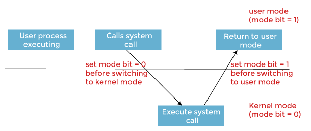

# Introduction

Recall that modern operating systems use virtualization of resources in order to make the management of processes flexible and efficient.

This experiment introduces the fundamental trick used to virtualize a process&rsquo;s access to the CPU&#x2014;namely, Context Switching. This technique allows the OS to handle arbitrary transfers of control during execution of user programs while still maintaining the overall control of the machine.

# Processes: A closer look

In the last experiment, we considered the 4 state model of a process, which provided us with a general overview of the process states and control transfer. Here, we will focus on the minute details of a process, its execution mechanism, and the transfers of control that take place during its execution&#x2014;both between user process and the kernel, and the other processes.

In this experiment, we will look more closely into the transfer of control between the processes and also the process modes. This is also where the crucial term - 'Context Switching' comes into play.

## What is Context Switching?

**Definition:** Context switching is the process that occurs when a multitasking operating system switches the execution context from one process or thread to another. 
It involves saving the current state (context) of a running process or thread so that it can be later restored and then loading the saved state of another process or thread to continue its execution. 
Context switching is a fundamental operation in modern operating systems and is necessary for efficient multitasking, allowing multiple processes or threads to share a single CPU.

-------------------------
In the above definition, we have encountered few terms like context and about loading, storing and restoring the context. Let us look more into what these terms and statements mean.

### Process Context
A process context refers to the current execution state and information associated with a running process in an operating system. It represents a snapshot of the process's execution at a particular point in time.

Process context can change dynamically while the process is executing on the CPU.

During a context switch, the current context of the process is stored in a data structure called 'Process Control block' which is later used to retreive the information of the process and resume it's excution from where it was interrupted.

### Process Control Block

In order to virtualize the execution of a process, the OS needs to have an internal account of the state of a process. This representation of the state of a process is stored in memory as a *Process Control Block(PCB)*.

The PCB is used primarily during context switches, but it doesn't actively reflect the process's changing context while it's running. Instead, the changing process context is stored in various CPU registers and memory locations, not within the PCB.

A process control block stores 3 kinds of information about a process&#x2014;namely, identification information (Pid), execution state, and control metadata used for 'scheduling' and 'Inter process communication(IPC)'.

<table border="2" cellspacing="0" cellpadding="6" rules="groups" frame="hsides">

<colgroup>
<col  class="org-left" />

<col  class="org-left" />
</colgroup>
<thead>
<tr>
<th scope="col" class="org-left">Type</th>
<th scope="col" class="org-left">Fields</th>
</tr>
</thead>

<tbody>
<tr>
<td class="org-left">Identification Information</td>
<td class="org-left">Pid</td>
</tr>

<tr>
<td class="org-left">Execution State Information</td>
<td class="org-left">PC, Mode, Registers, Flags, stacks etc.</td>
</tr>

<tr>
<td class="org-left">Scheduling &amp; IPC Information</td>
<td class="org-left">Priority, pointer to the next PCB, IPC messages etc.</td>
</tr>
</tbody>
</table>

In the above table, the execution state information holds data about the mode or level in which the process is executing in, along with the execution stack informations.

Let us take a closer look at these both terms and see how they play a important role in context switching.

### Modes of Execution

In the context of the Linux operating system architecture, there are primarily two main modes of execution:

1. **User Mode**:
   - **Privileges**: Limited privileges.
   - **Use Case**: User applications run in user mode. In this mode, processes have restricted access to system resources and cannot directly perform privileged operations. User-level code executes with a reduced set of permissions, and it cannot directly access or modify hardware resources or perform critical system tasks.

2. **Kernel Mode (Supervisor Mode or Privileged Mode)**:
   - **Privileges**: Full control over hardware and system resources.
   - **Use Case**: The Linux kernel operates in kernel mode. It has unrestricted access to the CPU, memory, hardware devices, and system services. Kernel mode is where the core operating system functions, such as device management, memory management, and system call handling, take place. Only code running in kernel mode can execute privileged operations and directly control hardware resources.

The transition between these two modes of execution is managed by the hardware. 

User-level processes running in user mode can request privileged operations (e.g., reading or writing to hardware devices or accessing protected memory) by making system calls. When a system call is made, control is transferred from user mode to kernel mode. The kernel performs the requested operation on behalf of the user-level process and then returns control to user mode.

This mode-switching mechanism is essential for maintaining system security and stability, as it prevents user-level processes from interfering with each other or with critical system resources. The Linux kernel enforces access controls and system policies to ensure that only authorized operations are allowed in kernel mode.

Below is a diagram showing the transition between two modes during the process execution period.

Source: [image source](https://www.google.com/url?sa=i&url=https%3A%2F%2Fwww.javatpoint.com%2Fdual-mode-operations-in-operating-system&psig=AOvVaw18NjcaKTyY51LQkQJAMyhf&ust=1696620666265000&source=images&cd=vfe&opi=89978449&ved=0CBMQjhxqFwoTCIDZmdPS34EDFQAAAAAdAAAAABAE)

### User stack and Kernel stack

In the Linux operating system (and many other operating systems), processes often maintain separate user-level and kernel-level stacks. These stacks serve different purposes and are used for distinct types of function calls and data storage. Here's an explanation of each:

1. **User Stack**:
   - **Purpose**: The user stack is used by a process to manage function calls and local variables within user-level code.
   - **Location**: The user stack is part of the process's memory space, typically allocated in the user portion of memory.
   - **Usage**: When a user-level function is called, the CPU uses the user stack to store information such as function parameters, local variables, and the return address (the address to which control should return after the function call). This stack is used for regular function calls and context within user-level code.
   - **Access**: User-level code has direct access to its user stack.

2. **Kernel Stack**:
   - **Purpose**: The kernel stack is used exclusively by the kernel when processing system calls, interrupts, and exceptions.
   - **Location**: Each process has its own kernel stack, typically located in kernel memory. The kernel stack for a process is separate from its user stack.
   - **Usage**: When a process makes a system call or encounters an exception, control switches from user mode to kernel mode. The kernel uses the process's kernel stack to store kernel-specific information and context, such as the state of CPU registers, kernel function call information, and other data needed to handle the system call or exception. It ensures that the kernel's activities do not interfere with the user-level stack.
   - **Access**: User-level code cannot directly access the kernel stack of a process. It's a part of the kernel's internal data structures.

The separation of user and kernel stacks is crucial for security and isolation. It ensures that user-level code cannot corrupt the kernel's data or execution state and vice versa. When a context switch occurs, the kernel saves the user-mode stack pointer and restores the kernel-mode stack pointer (or vice versa) to facilitate a seamless transition between user mode and kernel mode.

Additionally, for system calls, the user-level code typically provides arguments and triggers a context switch to kernel mode, where the kernel can access the user's arguments and perform the requested operation. After the kernel's work is done, it returns to user mode using the user stack, ensuring a clean separation between user and kernel code.

Now that all the important terms have been discussed, let us understand the mechanism of context switching. 

## Mechanism of context switching

### Execution State

1.  CPU State

    1.  General Purpose Registers
    
    2.  Control Registers
    
        <table border="2" cellspacing="0" cellpadding="6" rules="groups" frame="hsides">
        
        
        <colgroup>
        <col  class="org-left" />
        
        <col  class="org-left" />
        </colgroup>
        <thead>
        <tr>
        <th scope="col" class="org-left">Register</th>
        <th scope="col" class="org-left">&#xa0;</th>
        </tr>
        </thead>
        
        <tbody>
        <tr>
        <td class="org-left">IDTR</td>
        <td class="org-left">&#xa0;</td>
        </tr>
        
        
        <tr>
        <td class="org-left">&#xa0;</td>
        <td class="org-left">&#xa0;</td>
        </tr>
        
        
        <tr>
        <td class="org-left">&#xa0;</td>
        <td class="org-left">&#xa0;</td>
        </tr>
        
        
        <tr>
        <td class="org-left">&#xa0;</td>
        <td class="org-left">&#xa0;</td>
        </tr>
        </tbody>
        </table>
        
        1.  IDTR

2.  Memory

    1.  Code
    
    2.  Execution Stacks
    
        1.  User Program Stack
        
        2.  Kernel Stack
        
        3.  Other stacks (Interrupt Subroutine Stack etc.)
    
    3.  Descriptor Tables
    
        These data structures provide the dispatch addresses for handlers and are used to implement interfaces. eg. Trap Table is used to implement the interface between software and hardware.

## Interfaces

### User Program-kernel interface: In and out of the Kernel

## Execution Protocols

### Modes of Execution

1.  Privilege Levels

# Execution Protocol

## Managing Control during Program Execution

